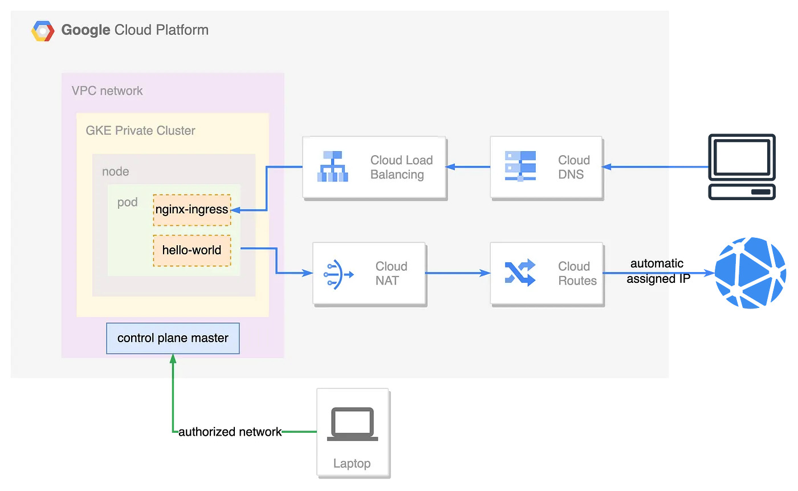

# ITI-Pipeline

This is my graduation project for the ITI program. It showcases a pipeline for deploying a Jenkins server on Google Kubernetes Engine (GKE) using Terraform for cluster creation, Ansible for Jenkins deployment, and Docker for Jenkins slave creation.

## Project Structure

The project consists of the following components:

1. `Terraform/`: Contains Terraform code for creating the GKE private cluster, vpc, subnet and nat gateway.



2. `ansible/`: Contains Ansible playbook for deploying Jenkins on the GKE cluster using kubectl.
3. `docker/`: Contains Dockerfile for building the Jenkins slave image.

## Prerequisites

Before running the project, make sure you have the following prerequisites installed and configured:

1. Google Cloud Platform (GCP) service account with appropriate permissions.
2. gcloud auth
3. Terraform CLI installed.
4. kubectl installed.
5. Ansible installed.
6. Docker installed.

## Installation

To deploy the Jenkins pipeline, follow these steps:

1. Clone the repository:
   ```bash
   git clone https://github.com/alytaha46/ITI-Pipeline.git
   ```

2. Update the terraform.tfvars file with your GCP credentials and desired cluster configuration.

   ```bash
    project_id               = "subtle-tooling-387906"
    region                   = "us-central1"
    vpc_name                 = "iti-vpc"
    auto_create_subnets      = false
    routing_mode             = "REGIONAL"
    subnet_name              = "private-subnet"
    subnet_cider             = "10.0.0.0/24"
    router_name              = "nat-router"
    nat_name                 = "nate-gatway"
    nat_ip_allocate          = "AUTO_ONLY"
    nat_source_subnet        = "ALL_SUBNETWORKS_ALL_IP_RANGES"
    cluster_name             = "my-private-cluster"
    cluster_location         = "us-central1-a"
    cluster_node_count       = 1
    cluster_private_nodes    = true
    cluster_private_endpoint = false
    cluster_master_cidr      = "10.16.0.0/28"
    cluster_master_authorized_networks_cidr = "102.191.249.56/32"
    cluster_master_authorized_networks_name = "Authorized Network"
    cluster_node_machine_type = "e2-medium"
   ```

3. Initialize the Terraform project:

    ```bash
    gcloud auth activate-service-account --key-file=/path/to/key-file.json
    cd Terraform
    terraform init
    terraform plan
    terraform apply
    ```
Create the GKE cluster:

bash
Copy code
terraform apply