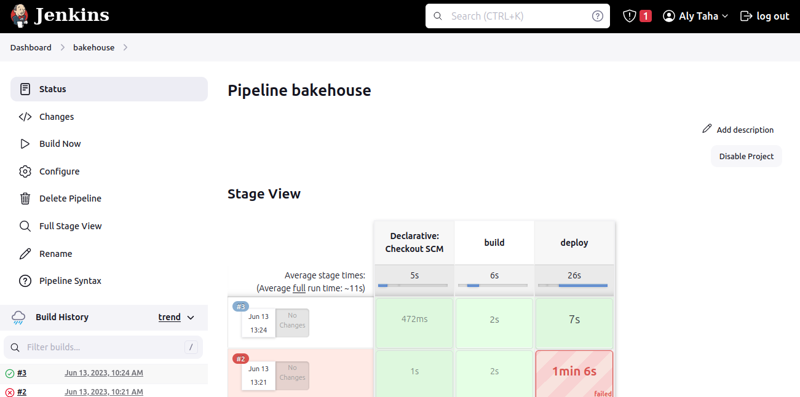

# ITI-Pipeline

This is my graduation project for the ITI program. It showcases a pipeline for deploying a Jenkins server on Google Kubernetes Engine (GKE) using Terraform for cluster creation, Ansible for Jenkins deployment, and Docker for Jenkins slave creation.

## Project Structure

The project consists of the following components:

1. `Terraform/`: Contains Terraform code for creating the GKE private cluster, vpc, subnet and nat gateway.


2. `ansible/`: Contains Ansible playbook for deploying Jenkins on the GKE cluster using kubectl.
3. `docker/`: Contains Dockerfile for building the Jenkins slave image.

## Prerequisites

Before running the project, make sure you have the following prerequisites installed and configured:

1. Google Cloud Platform (GCP) service account with appropriate permissions.
2. gcloud auth
3. Terraform CLI installed.
4. kubectl installed.
5. Ansible installed.
6. Docker installed.

## Pipeline Steps

### Step 1: Create GKE Cluster with Terraform

1. Clone the repository:
   ```bash
   git clone https://github.com/alytaha46/ITI-Pipeline.git
   ```

2. Update the terraform.tfvars file with your GCP credentials and desired cluster configuration.

   ```bash
    project_id               = "subtle-tooling-387906"
    region                   = "us-central1"
    vpc_name                 = "iti-vpc"
    auto_create_subnets      = false
    routing_mode             = "REGIONAL"
    subnet_name              = "private-subnet"
    subnet_cider             = "10.0.0.0/24"
    router_name              = "nat-router"
    nat_name                 = "nate-gatway"
    nat_ip_allocate          = "AUTO_ONLY"
    nat_source_subnet        = "ALL_SUBNETWORKS_ALL_IP_RANGES"
    cluster_name             = "my-private-cluster"
    cluster_location         = "us-central1-a"
    cluster_node_count       = 1
    cluster_private_nodes    = true
    cluster_private_endpoint = false
    cluster_master_cidr      = "10.16.0.0/28"
    cluster_master_authorized_networks_cidr = "102.191.249.56/32"
    cluster_master_authorized_networks_name = "Authorized Network"
    cluster_node_machine_type = "e2-medium"
   ```

3. Initialize the Terraform project:

    ```bash
    gcloud auth activate-service-account --key-file=/path/to/key-file.json
    cd Terraform
    terraform init
    terraform plan
    terraform apply
    ```

### Step 2: Deploy Jenkins with Ansible

1. Navigate to the ansible directory and Execute the Ansible playbook to deploy Jenkins master and slave:

   ```bash
   cd ../ansible
   ansible-playbook deploy.yaml
   ```

### Step 3: Setup Jenkins

1. get jenkins ip to access it throw the browser :8080 

   ```bash
    kubectl get service jenkins-service -n devops-tools --output='jsonpath={.status.loadBalancer.ingress[0].ip}'
   ```

2. get initial password from Jenkins pod

   ```bash
    kubectl get po -n devops-tools
    kubectl exec -it <jenkins-master-pod-name> -n devops-tools bash
    ```
   ```bash
    cat /var/jenkins_home/secrets/initialAdminPassword
   ```

3. create jenkis user


### Step 4: Setup Jenkins slave

1. create password for jenkins user at slave pod and change permession fro docker.sock

   ```bash
    kubectl get po -n devops-tools
    kubectl exec -it <jenkins-slave-pod-name> -n devops-tools bash
   ```
   ```bash
    passwd jenkins
    chmod 777 /var/run/docker.sock
   ```

2. get initial password from Jenkins pod

   ```bash
    kubectl get po -n devops-tools
    kubectl exec -it <jenkins-master-pod-name> -n devops-tools bash
    ```
   ```bash
    cat /var/jenkins_home/secrets/initialAdminPassword
   ```

3. link the slave by adding node at Jenkins master and add service account 


### Step 5: Create pipeline

1. setup secret files using in jenkins script


2. create pipeline

   ```bash
    pipeline {
        agent { label 'jenkins_slave' }
        stages {
            stage('build') {
                steps {
                    echo 'build'
                    script {
                        withCredentials([usernamePassword(credentialsId: 'docker_login', usernameVariable: 'DOCKER_USERNAME', passwordVariable: 'DOCKER_PASSWORD')]) {
                                sh '''
                                    docker login -u ${DOCKER_USERNAME} -p ${DOCKER_PASSWORD}
                                    docker build -t alytaha46/bakehouseproject:v${BUILD_NUMBER} .
                                    docker push alytaha46/bakehouseproject:v${BUILD_NUMBER}
                                '''
                        }
                    }
                }
            }
            stage('deploy') {
                steps {
                    echo 'deploy'
                    script {
                        withCredentials([file(credentialsId: 'slave_kubeconfig', variable: 'KUBECONFIG_ITI'),
                                        file(credentialsId: 'service_account_key', variable: 'KEYY')]) 
                        {
                            sh """
                                gcloud auth activate-service-account --key-file ${KEYY}
                            """
                            // Check if the release is already deployed
                            def releaseStatus = sh(returnStatus: true, script: "helm status bakehouseapp --kubeconfig ${KUBECONFIG_ITI}")
                            // Install or upgrade the custom chart using Helm based on the release status
                            if (releaseStatus == 0) {
                                sh """
                                    helm upgrade bakehouseapp ./bakehousechart/ --kubeconfig ${KUBECONFIG_ITI} --set image.tag=v${BUILD_NUMBER} --values bakehousechart/master-values.yaml
                                """
                            } else {
                                sh """
                                    helm install bakehouseapp ./bakehousechart/ --kubeconfig ${KUBECONFIG_ITI} --set image.tag=v${BUILD_NUMBER} --values bakehousechart/master-values.yaml
                                """
                            }
                        }
                    }
                }
            }
        }
    }      
   ```




3. get bakehouse app ip to access it throw the browser 

   ```bash
    kubectl get service bakehouseapp-service -n bakehouse-ns --output='jsonpath={.status.loadBalancer.ingress[0].ip}'
   ```